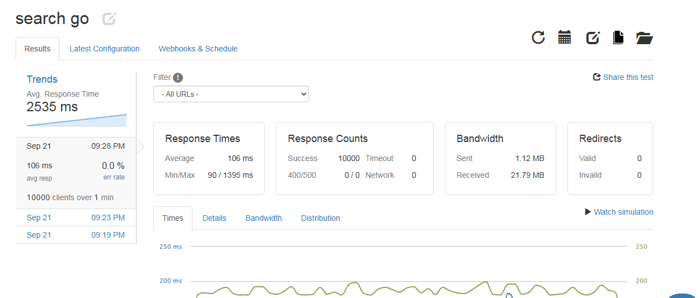
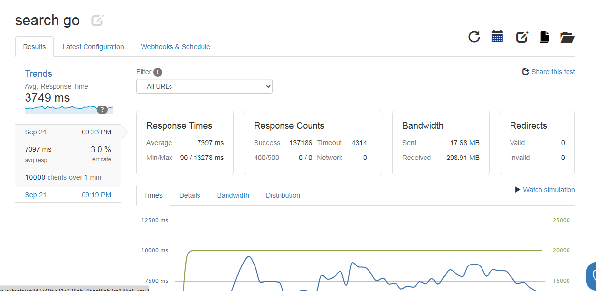

i should use load.io

and they will request to add there txt file, u should add it in public and also in cmd/main.go

run 
`go build -o outPut ./cmd/main.go`

and them

`./outPut`

the performance are stunning
while Laravel with Swoole or FrankenPHP were crashing after 10seconds of loads with high CPU usage in all cores which is understandable

### With 10k per Minutes

### With 10k per Second

### Verdict

Obviously Go is a near to metal level, which is the reason of the high performance, Issue I cannot give up of Laravel Echosystem, since Go is lacking this side, which means maybe I can do Read with Go, and Write will be with Laravel, 

but now I m in need for websocket in most of my projects, and laravel Reverb fits well 